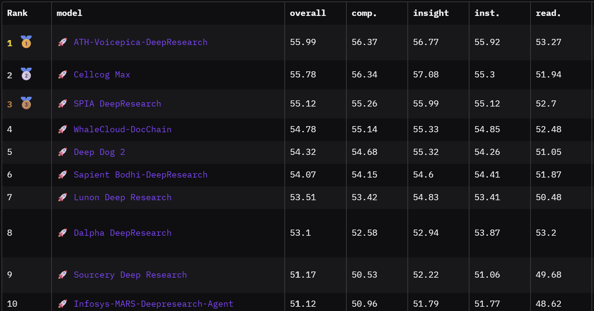

# Deep Dog 2 — research engine

Turn a question into a cited Markdown report. A supervisor plans the research, delegates work to platform agents, reviews their findings, and writes the final report.

This is the **Python package version** of Deep Dog 2. Call `run_research()` with a per-run configuration to choose models, search, agent types and research budgets without editing the engine.

Created by [Benjamin Andrew Eadie](https://beneadie.netlify.app/).

## Official benchmark results

At the time of publication, Deep Dog 2 ranked **5th overall** and **1st among open-source research agents** on the [DeepResearch Bench](https://huggingface.co/spaces/muset-ai/DeepResearch-Bench-Leaderboard). The published run used a relatively economical profile: a 15-minute research window, a 20-iteration supervisor cap, at most 3 Exa searches per sub-agent, DeepSeek V4 Pro as supervisor, and DeepSeek V4 Flash for sub-agents.



*DeepResearch Bench rankings, with Deep Dog 2 shown in fifth place.*

| Metric | Score |
|---|---:|
| Overall | **0.5432** |
| Comprehensiveness | 0.5468 |
| Insight | 0.5532 |
| Instruction Following | 0.5426 |
| Readability | 0.5105 |

These results are a historical reproducibility profile, not a promise about current defaults. The current package defaults to DeepSeek V4 Flash for all model roles and uses a different supervisor iteration default. Benchmark rankings and scores may change as the leaderboard changes.

For a detailed explanation of the reflection and delegation methods used, see the engineering article [Deep Dog 2: How Reflection and Structured Delegation Improve Supervisor–Subagent Research Systems](https://beneadie01.substack.com/p/deep-dog-2-how-reflection-delegation).

## Quickstart

Requires **Python 3.11+**, LLM API access and a search API key. From this repository's root:

```bash
python -m venv .venv
```

Activate the environment:

```bash
# macOS / Linux
source .venv/bin/activate
```

```powershell
# Windows PowerShell
.venv\Scripts\Activate.ps1
```

Install the package:

```bash
python -m pip install -e .
```

Copy [`.env.example`](.env.example) to `.env` and fill in these two keys:

```dotenv
DEEPSEEK_API_KEY=your-deepseek-key
EXA_API_KEY=your-exa-key
```

Run a question:

```bash
python scripts/quickstart.py "Compare sodium-ion and LFP batteries for home energy storage."
```

The report is saved to `outputs/report.md`. Each run replaces that file; use `--output outputs/batteries.md` to choose another name. Interrupted output is saved as `report.partial.md`, and the command exits with a nonzero status.

**Change settings in the `CONFIG` block in [scripts/quickstart.py](scripts/quickstart.py).** It includes models, search, agent selection, time limits, iteration limits and search budgets. Keep credentials in `.env`.

The quickstart uses **DeepSeek V4 Flash for every model role**: supervisor, sub-agents, research brief and draft. The supervisor also writes the final report. You only need one model-provider account, plus Exa for search.


## Use in your application

The distribution package name is `deep-dog-2` (PyPI normalizes this and `deep_dog_2` to the same name); the import name is `deep_research`. Install from a local checkout with `python -m pip install /path/to/checkout`.

### Minimal example

For a ready-to-run file, edit `QUESTION` in [scripts/simple_research.py](scripts/simple_research.py), then run:

```bash
python scripts/simple_research.py
```

It prints progress and the returned report text, using the default configuration with no settings block. No Markdown file is created by default.

With the API keys above in `.env`, no configuration object is required:

```python
import asyncio
from dotenv import load_dotenv

load_dotenv()

from deep_research.integration import run_research

result = asyncio.run(run_research("How is geothermal energy developing in Europe?"))
print(result.status)
print(result.final_report)
```

The report is a Markdown-formatted string. To save it, add:

```python
from pathlib import Path

if result.status == "completed":
    Path("report.md").write_text(result.final_report, encoding="utf-8")
```

Automatic engine file saving is off by default. An existing `SAVE_REPORT_TO_FILE=true` deployment setting can enable it; remove that override for the default text-only behavior. The configurable quickstart script explicitly saves its own output.

This uses the package's deployment defaults: Web research with Exa and DeepSeek V4 Flash for all model roles. The default research window is 5–15 minutes, with 30 supervisor rounds, 5 rounds per sub-agent and 3 searches per sub-agent. Environment overrides can change these defaults. The configurable CLI example above uses the same models with a shorter research budget.

### Change only what you need

Every `RunConfig` field is optional. For example, to change the enabled agents and search budget, replace the `run_research` call above with:

```python
from deep_research.integration import RunConfig

result = asyncio.run(run_research(
    "How is geothermal energy developing in Europe?",
    config=RunConfig(
        enabled_agents=["ResearchWeb", "ResearchArxiv"],
        subagent_max_searches=2,
    ),
))
```

For full control, expand the example below or edit [scripts/quickstart.py](scripts/quickstart.py). Every available field is listed in [run_config.py](deep_research/run_config.py), with the main options explained in the following sections.

<details>
<summary>Full configuration example: models, agents, search, budgets and output</summary>

```python
import asyncio
from dotenv import load_dotenv

load_dotenv()  # Before engine imports: deployment defaults are read at import.

from deep_research.integration import RunConfig, run_research

config = RunConfig(
    supervisor_model_fallback_chain=["deepseek-v4-flash"],
    subagent_model_fallback_chain=["deepseek-v4-flash"],
    draft_report_model_fallback_chain=["deepseek-v4-flash"],
    enabled_agents=["ResearchWeb"],
    web_search_engine="exa",
    research_time_min_minutes=2,
    research_time_max_minutes=10,
    supervisor_max_iterations=20,
    subagent_max_iterations=5,
    subagent_max_searches=3,
    output_mode="none",
    log_mode="none",
    save_report_to_file=False,
    enable_source_log=False,
    logging_enabled=False,
)

async def main():
    result = await run_research(
        "How is geothermal energy developing in Europe?", config=config
    )
    print(result.status)  # completed, partial, failed, cancelled, or timed_out
    if result.failure:
        print(result.failure)
    print(result.final_report)

asyncio.run(main())
```

</details>

In an async application or notebook, use `await run_research(...)` directly. Check `result.status`: partial output may be an unfinished draft. Results also include `source_registry`, `curated_sources`, `run_metadata` and `logs`; use `result.to_dict()` for serialization.

For request-specific credentials, pass `credentials=Credentials({"DEEPSEEK_API_KEY": key, ...})`, importing `Credentials` from the integration module. Missing entries fall back to the process environment. Use separate configuration and credentials for each request rather than changing environment variables while runs are active.

## Choose models

Each role takes an ordered list of model names. **A one-item list simply selects one model**; you do not need to configure fallbacks.

| `RunConfig` field | Role | Quickstart choice |
|---|---|---|
| `supervisor_model_fallback_chain` | Planning, delegation and final report | `["deepseek-v4-flash"]` |
| `subagent_model_fallback_chain` | Platform research and sub-agent report writing | `["deepseek-v4-flash"]` |
| `draft_report_model_fallback_chain` | Research brief and initial draft | `["deepseek-v4-flash"]` |

Native DeepSeek uses `DEEPSEEK_API_KEY`; NVIDIA names route through OpenRouter and use `OPENROUTER_API_KEY`. To route the supervisor's DeepSeek model through OpenRouter too, set `supervisor_route_via_openrouter=True`.

To use another model, replace the name in the relevant role field. Agent models need tool calling; the brief model needs structured output. For fallbacks after model errors, add alternatives and set `disable_model_fallback=False`. Entries without credentials may be skipped during model construction even when runtime fallback is disabled.

Supported model routing is in [config.py](deep_research/config.py). Google models additionally require `python -m pip install -e ".[google]"`.

The quickstart explicitly selects V4 Flash for each role. A bare `RunConfig()` also defaults to V4 Flash for each role, unless overridden by deployment environment settings.

### Optional Nemotron profile

Nemotron 3.5 Lightning remains supported through OpenRouter and is a good low-cost choice for the research brief and initial draft. Those passes need structured output, but they do not call search or research tools. Keep DeepSeek for the supervisor and platform sub-agents unless the OpenRouter endpoint you choose explicitly supports tool calling:

```python
config = RunConfig(
    supervisor_model_fallback_chain=["deepseek-v4-flash"],
    subagent_model_fallback_chain=["deepseek-v4-flash"],
    draft_report_model_fallback_chain=["nvidia/nemotron-3.5-lightning"],
    draft_route_via_openrouter=True,
)
```

This profile needs both `DEEPSEEK_API_KEY` and `OPENROUTER_API_KEY`. The model name is routed through OpenRouter automatically, but the explicit `draft_route_via_openrouter=True` makes the choice clear. You can use Nemotron for the supervisor or sub-agents only with a tool-capable endpoint; the standard model listing may expose endpoints that support structured output but not tools. See [Nemotron on OpenRouter](https://openrouter.ai/nvidia/nemotron-3.5-lightning) before changing those roles.

## Choose search and agent types

Set `web_search_engine` to `"exa"`, `"tavily"`, or `"both"`. Supply `EXA_API_KEY`, `TAVILY_API_KEY`, or both keys respectively. This selects **web search**; specialist agents use their own platform tools.

Only Web is enabled by default. Add the exact names you want:

```python
enabled_agents=["ResearchWeb", "ResearchArxiv", "ResearchPubMed"]
```

| Agent name | Searches / reads | Additional setup |
|---|---|---|
| `ResearchWeb` | General web sources | Exa and/or Tavily key |
| `ResearchReddit` | Reddit discussions | `REDDIT_CLIENT_ID`, `REDDIT_CLIENT_SECRET`, `REDDIT_USERNAME`, `REDDIT_PASSWORD` |
| `ResearchSubstack` | Substack articles | `PERPLEXITY_API_KEY` for search |
| `ResearchArxiv` | arXiv papers | No platform key |
| `ResearchPubMed` | PubMed literature | Set `PUBMED_EMAIL` to your contact email |
| `ResearchSEC` | SEC EDGAR filings | Set `SEC_EDGAR_CONTACT_EMAIL` to your contact email |
| `ResearchGeneral` | Multiple platforms | Credentials for the platforms you allow |

For `ResearchGeneral`, set `general_agent_platforms=["web", "arxiv"]` to limit its tools. An empty list allows all platforms. Platform keys use lowercase names (`sec_edgar` for SEC), while `enabled_agents` uses the `Research...` names above.

Enabling an agent makes it available; it does not force the supervisor to use it. Discovery and focused research use the same enabled platforms with different instructions and output modes.

`validate_credentials(config, credentials)` provides the quickstart's preflight check. It checks presence, not key validity or account credit. Its specialist checks are incomplete: Perplexity is currently reported as optional even when Substack needs it. Supply the platform credentials listed above.

## Set research budgets

All fields below belong to `RunConfig`. These are the **quickstart values**, not all library defaults.

| Field | Example | Meaning |
|---|---:|---|
| `research_time_min_minutes` | `2` | Minimum window before the supervisor normally accepts completion; other stop conditions can end earlier |
| `research_time_max_minutes` | `10` | Target research window; the supervisor then wraps up and writes the final report |
| `supervisor_max_iterations` | `20` | Supervisor loop budget, separate from sub-agent budgets |
| `subagent_max_iterations` | `5` | Research tool-call rounds per delegated agent |
| `subagent_max_searches` | `3` | Search tool calls per delegated agent, across its rounds |
| `subagent_max_reads` | `10` | Items read per round |
| `subagent_max_total_reads` | `25` | Default total read allowance per agent; the supervisor can override it for a task |
| `subagent_max_saves` | `10` | Sources saved per agent |
| `subagent_max_concurrency` | `3` | Parallel tool calls inside an agent |

**Do not give sub-agents fewer than four loops for normal research.** They need room to **search → select → read → save**. Five is a useful starting point. These describe the work that must fit, not four mandatory one-tool stages: a round can batch calls, and selection can happen during reasoning. Lower values are technically accepted but risk shallow or empty findings. Inline reports also need a final turn to write their answer.

Search limits are **per delegated agent, not global**. Ten agent invocations with three searches each can make up to 30 search tool calls. Search hits, provider requests and billable units are not necessarily the same as tool calls. More supervisor rounds can launch more agents and increase total cost.

**There is no whole-run hard timeout.** Time guidance encourages the supervisor to wrap up. Once the target research window plus one minute has elapsed, the next supervisor tool-routing step moves to final report writing instead of starting more research. Reaching the supervisor iteration limit also moves to final writing. Work already underway is allowed to return, and final writing and citation processing can finish after the research window, so total runtime can be longer than the configured research time.

The original per-subagent timeout (`subagent_timeout_seconds`, default 600, plus 30 seconds of outer allowance) and individual model/tool request timeouts still apply. These are separate from the research window. A host can also explicitly cancel a run; cancellation of synchronous work may not be instantaneous.

`supervisor_max_concurrent_research` and `supervisor_max_concurrent_discovery` guide delegation in the prompt; they are **not enforced concurrency caps**. Configuration values are also bounded by safety ceilings in [run_config.py](deep_research/run_config.py).

## Curation agents and inline reports

The supervisor always produces the final report. These settings control what **sub-agents return to it**:

| Mode | How evidence is handled | Sub-agent returns |
|---|---|---|
| `sources` | Saves useful sources as it goes | Curated source list with selection reasons; no extra report-writing call |
| `report` | Saves useful sources as it goes | Mini-report from a separate model call using saved evidence |
| `sources_inline` | Reads first, selects sources near the end | Curated source list |
| `report_inline` | Keeps research in its conversation context | Mini-report written in the agent's own final response |

**Curation** (`sources` / `report`) makes the agent explicitly preserve useful evidence. Use `sources` when you want the supervisor to do the synthesis, or `report` when each task should return a written summary based on selected evidence.

**Inline reports** (`report_inline`) let the same agent write from the material it has seen, without a separate writer call. They suit discovery work that maps a topic or suggests research directions. They retain more material in context, so avoiding an extra call does not necessarily mean lower total cost.

Start with `subagent_output_mode="sources"` for focused research and `discovery_output_mode="report_inline"` for discovery. “Inline” describes where the agent writes its deliverable; it does not refer to citation style or streamed output.

## Integration and diagnostics

**Console progress is on by default**, starting with the research brief and initial draft, followed by research activity and final writing. Messages are flushed immediately, so a model call should show which stage is waiting. To suppress console progress, pass `runtime=RuntimeOptions(console_enabled=False)` (import `RuntimeOptions` from `deep_research.integration`). Console progress is independent of `logging_enabled`, which controls detailed trace records.

Each sub-agent prints its own completion time and totals for search calls, distinct items read, and selected (saved) sources. Inline reports may have no explicitly saved sources. The console iteration display starts at zero; this does not change the research budget. Individual source events remain available through `event_sink` without printing a line for every source.

`RuntimeOptions` accepts event, trace and artifact sinks, cancellation, a checkpointer and run/thread IDs. Import it from `deep_research.integration`. Applications can keep output in memory and persist the returned report themselves, as the quickstart does. Database storage is a host responsibility; `output_mode="db"` does not install a database backend.

Structured logging is on by default in the library. Set `logging_enabled=True` to retain rich records in `result.logs` or stream them to a `trace_sink`. These contain prompts, model-provided reasoning, tool calls and report content. Credential values are redacted, but research content remains. `log_truncation=2000` limits each logged string; `None` means no truncation. `TraceCollector` is an in-memory sink. Product events are separate from rich traces.

The older [run_research.py](run_research.py) remains available for timestamped output and prompt files (`python run_research.py --help`). It uses its own deployment configuration; editing the quickstart's `CONFIG` does not configure that runner. [run_platform.py](deep_research/run_platform.py) runs a single platform agent for development.

Common issues:

- **Import fails:** install into the same interpreter used to run your app (`python -m pip install -e .`).
- **Missing keys:** load `.env` before engine imports and configure all three model roles. Use `RunConfig` for per-request changes.
- **Model rejects tools or structured output:** choose an endpoint with the required capability; the routing catalog is not a live provider compatibility check.
- **Empty or partial report:** inspect `status`, `failure` and `run_metadata`, allow at least four sub-agent loops, and leave time for writing.
- **Unexpected scope:** include the region, date range, audience and desired output in your question. The current graph does not pause to ask the user clarifying questions.

## Development

```bash
python -m pip install -e ".[dev]"
python -m pytest
```

Normal tests use fake providers and do not require paid API calls. Dependencies are declared in [pyproject.toml](pyproject.toml); `requirements.txt` delegates to it.

Manual platform diagnostics live in [scripts/test_tools.py](scripts/test_tools.py). Run `python scripts/test_tools.py --help` for options. Platform checks contact live providers and need their credentials; they are separate from the normal test suite.

Only the `OPEN` prompt workflow is supported. Older configurations using `prompt_version="LEGACY"` or `PROMPT_VERSION=LEGACY` must switch to `OPEN`. The legacy example-report prompts and iterative draft-refinement tool have been removed; the initial draft and final report stages remain.

Start with [integration.py](deep_research/integration.py) for the API and [run_config.py](deep_research/run_config.py) for configuration. Platform tools live under [deep_research/agents](deep_research/agents).

## Attribution and release status

Deep Dog 2 builds on Deep Dog 1 and [ThinkDepth Deep Research](https://github.com/thinkdepthai/Deep_Research) by Paichun Lin.

This project is released under the MIT License. It builds on [ThinkDepth Deep Research](https://github.com/thinkdepthai/Deep_Research) by Paichun Lin; see [LICENSE](LICENSE) for the full attribution and license notices.
